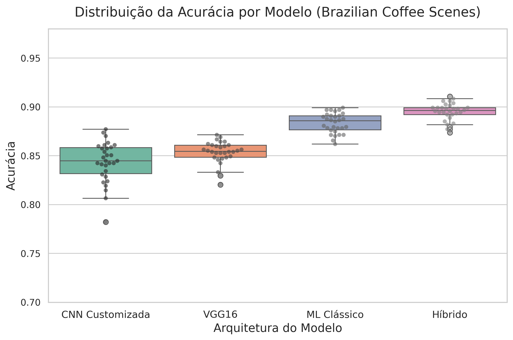
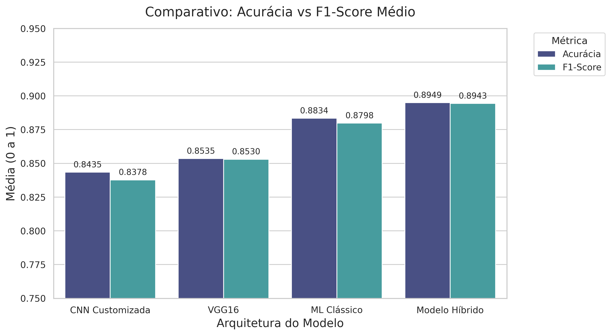

# Classificação Híbrida de Cenas de Café Brasileiro (UTFPR)

Este projeto implementa uma abordagem híbrida de Visão Computacional para a classificação de imagens do *Brazilian Coffee Scenes Dataset*. A pesquisa compara o uso de redes neurais profundas (Deep Learning) com a fusão de descritores avançados de textura e cor para identificar áreas de cultivo de café.

## 🚀 Metodologia

O experimento avalia a eficácia da combinação de características visuais extraídas automaticamente pela **VGG16** com meta-features extraídas via algoritmos clássicos. 

As meta-features foram obtidas utilizando o [image-meta-feature-extractor](https://github.com/gabrieljaguiar/image-meta-feature-extractor), incluindo:
* Matriz de Co-ocorrência de Tons de Cinza (GLCM);
* Padrões Binários Locais (LBP);
* Estatísticas globais de cor e brilho.

## 📊 Resultados Finais

Após 30 rodadas experimentais (seeds), o **Modelo Híbrido** demonstrou superioridade estatística e preditiva.

| Modelo | Acurácia Média | F1-Score Médio |
| :--- | :---: | :---: |
| **Modelo Híbrido** | **89.49%** | **0.8951** |
| ML Clássico (Random Forest) | 88.34% | 0.8831 |
| VGG16 (Baseline DL) | 85.35% | 0.8529 |
| CNN Customizada | 84.35% | 0.8440 |

### Validação Estatística
Utilizou-se o teste de **Wilcoxon Signed-Rank Test** ($\alpha = 0.05$) para validar a hipótese de superioridade do modelo proposto:
* **Híbrido vs VGG16:** $p = 1.72 \times 10^{-6}$
* **Híbrido vs ML Clássico:** $p = 2.96 \times 10^{-5}$
* **Híbrido vs CNN:** $p = 1.73 \times 10^{-6}$

Os resultados confirmam que a fusão de dados é estatisticamente superior às abordagens isoladas.

## 📈 Visualizações

<p align="center">
  
  
</p>

## 📂 Estrutura do Repositório

* `scripts/`: Códigos `.py` para geração de datasets, treino e testes estatísticos.
* `results/`: Gráficos gerados e planilhas de performance de cada modelo.
* `data/`: Contém as meta-features extraídas (`coffee_meta_features.csv`).
    * *Nota: Arquivos de dados pesados (>25MB) não são versionados e devem ser gerados localmente.*

## 🛠️ Como Reproduzir

1.  Clone o repositório.
2.  Instale as dependências: `pip install -r requirements.txt`.
3.  Baixe o [Brazilian Coffee Scenes Dataset](https://www.kaggle.com/datasets/giovannimeloni/brazilian-coffee-scenes-dataset) e coloque-o na raiz.
4.  Execute a esteira de processamento:
    ```bash
    python scripts/
